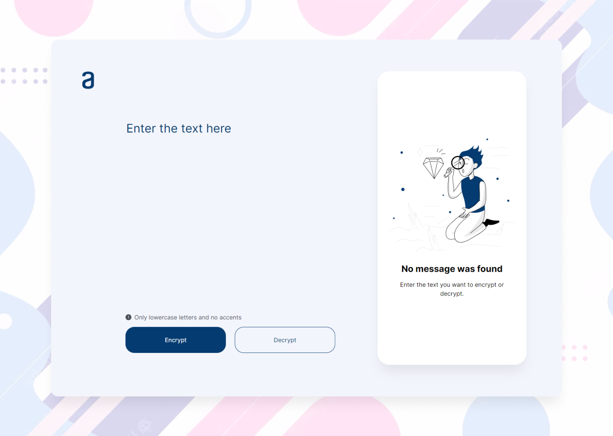

# Challenge ONE - Build a text encryptor with Javascript.

This is a solution to the [Build a text encryptor with Javascript](https://www.aluracursos.com/challenges/challenge-one-logica/sprint01-construye-un-encriptador-texto-con-javascript). A challenge proposed by [AluraLatam](https://www.aluracursos.com/), which seeks to improve coding skills by building an application that can encrypt and decrypt text messages.

## Table of contents
- [Overview](#overview)
  - [The challenge](#the-challenge)
  - [Preview](#preview)
  - [Links](#links)
- [The process](#the-process)
  - [Requirements](#requirements)
  - [Built with](#built-with)
  - [Extras](#extras)
- [Author](#author)

## Overview

### The challenge

Welcome to our first challenge!

In this challenge, you will build an application that will allow you to encrypt and decrypt texts. You will then be able to exchange secret messages with other people who know the cipher used.

The encryption `keys` we will use are the following:

```
The letter "e" becomes "enter".
The letter "i" becomes "imes".
The letter "a" becomes "ai".
The letter "o" becomes "ober".
The letter "u" becomes "ufat".
```

### Preview

\
↪ *This is a preview of the challenge.*

### Links

- Solution URL: [Link](https://github.com/byhelaman/encryptor)
- Live Site URL: [Link](https://byhelaman.github.io/encryptor/)

## The process
### Requirements
- The application must only work with lowercase letters.
- Letters with accents or special characters must not be used.
- It must be possible to convert a word to the encrypted version and also return an encrypted word to its original version.

For example:
```
"gato" => "gaitober"
"gaitober" => "gato"
```

- The page must have fields to insert the text to be encrypted or decrypted, and the user must be able to choose between the two options.
- The result should be displayed on the screen.

### Built with

- Semantic HTML5 markup
- JavaScript logic
- CSS custom properties
- Flexbox | CSS Grid
- Mobile-first workflow

### Extras

A button to copy the encrypted/decrypted text to the transfer section, i.e. with the same functionality as `Ctrl+C` or the `Copy` option in the application menu.

## Author

- AluraLatam - [@byhelaman](https://app.aluracursos.com/user/byhelaman)
- Twitter - [@byhelaman](https://www.twitter.com/byhelaman)